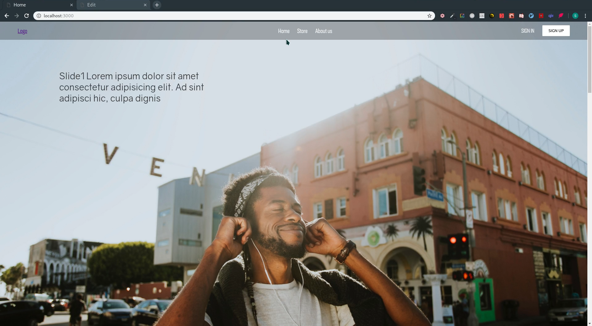

## Music shop e-commerce web app [](https://opensource.org/licenses/MIT)

<span style="color:red">This is an early stage of the app, it's <strong style="color:red">NOT</strong> ready for production and currently not hosted anywhere. If you want to test it follow the installation instructions below.</span>

NOTE: This app is made for educational purposes. Nothing is being sold on there and checkout doesn't work.

#### Description:

Modern e-commerce SPA(single-page app) made with MERN stack.

#### To do:

upload images option, error handling, account management, integrate add/delete/edit from /edit to account, cart, checkout, smaller screens design, logo, lazy loading...

#### Bugs to fix

Account dropdown menu width
Product count in cart
Change popup to modal (naming)

#### Video:

<hr/>

<a href="https://player.vimeo.com/video/352587088" target="_blank"></a>

<hr/>

#### Technologies used:

**Frontend:**

- HTML5
- CSS3(Sass)
- Javascript(ReactJS)

**Backend:**

- NodeJS with expressJS
- MongoDB with mongoose

\***Server:**

- Nginx
- CentOS/Ubuntu

\*_Will be added later_

#### Installation (for testing)

```sh
  git clone https://github.com/DKSadx/Music-shop.git
  cd Music-shop
  npm run install-all
  npm start
```

\*_NOTE: You will need to use your own database.
`.env` file for mongoDB should look like this:_

```env
/server/.env
  MONGO_USER=_____  // Database username
  MONGO_PWD=_____   // Database password
  MONGO_DATABASE=_____  // Database path/link
```
