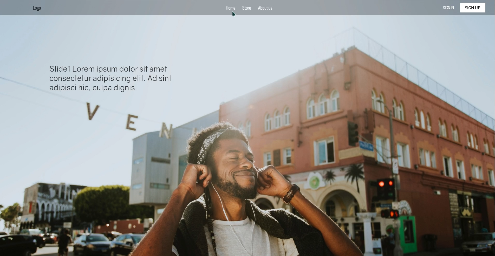

## Music shop e-commerce web app [](https://opensource.org/licenses/MIT)

NOTE: This app is made for educational purposes. Nothing is being sold on there and checkout doesn't work.

#### Description:

Modern e-commerce music shop app made with MERN stack. React was used for the front-end together with GSAP and Scrollmagic NPM packages for creating better animations and react-router for routing and keeping the URL synced with the page. NodeJS was used for the back-end together with expressJS for creating REST APIs that perform CRUD operations on the NoSQL database. For the NoSQL database, MongoDB together with mongoose was used.

#### Video <a href="https://player.vimeo.com/video/370718718" target="_blank">here</a>:

<hr/>



<hr/>

#### Technologies used:

**Frontend:**

- HTML5
- CSS3(Sass)
- Javascript(ReactJS)

**Backend:**

- NodeJS with expressJS
- MongoDB with mongoose

**Server:**

- Nginx
- CentOS

#### Installation (for testing)

```sh
  git clone https://github.com/DKSadx/Music-shop.git
  cd Music-shop
  npm run install-all
  npm start
```

\*_NOTE: You will need to use your own database.
`.env` file for mongoDB should look like this:_

```env
/server/.env
  MONGO_USER=_____  // Database username
  MONGO_PWD=_____   // Database password
  MONGO_DATABASE=_____  // Database path/link
```
